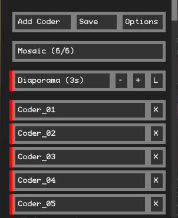

# Bonzomatic Network Launcher


## What's this?
This is a tool to launch and manage several bonzomatic windows.
It was made to help with the Shader Royale competition by psenough.
The tool can:
- Launch several Bonzomatic Network windows, one for each distant coder
- Each windows can then be toggled visible
- Place the windows in a mosaic on your screen
- Display one of the windows in fullscreen while hiding all the others
- Launching a diaporama of all the windows
- Toggleing text editor on all the bonzo windows by pressing F11 in the control Windows

By resizing the bonzomatic windows, this tool let them take more or less of the GPU power. With this, you can have dozen's of coder's shader running on one PC while still maintaining a good framerate and being able to put one in fullscreen when you want.
For streaming, the best is to dedicace one screen with a neutral background where all the bonzomatic windows will be placed and the whole screen will be reccorded

To use it, just unzip it in same folder as Bonzomatic Network.

## Keys
- M: Show mosaic mode
- D: Launch a diaporama
- O: Toggle displaying options
- A: Add a new coder
- [0-9]: coders 1-10 in full screen
- ctrl+[0-9]: coders 11-20 in full screen
- shift+[0-9]: coders 21-30 in full screen
- alt+[0-9]: coders 31-40 in full screen
- Left/right: show previous/next coder in full screen
- F11: toggle shader overlay on all bonzo windows

## Configuration
You can configure the launcher by tweaking the `launcher.json` that is next to the binary executable.

Example: (all fields are optional)
``` javascript
{
  "bonzo": {
    "commandline": "skipdialog networkMode=grabber",
    "delay_between_spawn": 2000,
    "exename": "Bonzomatic_W64_GLFW.exe"
  },
  "coders": [
    "Coder_01",
    "Coder_02",
    "Coder_03",
    "Coder_04"
  ],
  "diaporama": {
    "bpm": 60,
    "loops": 1,
    "infiniteloop": false
  },
  "font": {
    "file": "ProFontWindows.ttf",
    "size": 16
  },
  "fullscreen": {
    "forceratio": true,
    "sizepercent_x": 1,
    "sizepercent_y": 1,
    "startpercent_x": 0,
    "startpercent_y": 0,
    "wantedratio": 1.7777,
    "codertogglemosaic":  false,
  },
  "mosaic": {
    "MosaicFixed": false,
    "border_x": 10,
    "border_y": 10,
    "forceratio": true,
    "sizepercent_x": 0.9,
    "sizepercent_y": 0.9,
    "startpercent_x": 0.05,
    "startpercent_y": 0.05,
    "wantedratio": 1.7777
  },
  "network": {
    "receiveuserlist": false,
    "serverURL": "ws:\/\/drone.alkama.com:9000\/roomtest\/"
  },
  "theme": {
    "background": "202020",
    "button": "333333",
    "buttonBorder": "808080",
    "buttonBorderHover": "FF8080",
    "buttonBorderPress": "FFFFFF",
    "buttonUncheck": "CC3333",
    "text": "FFFFFF"
  }
} 

```

This tool has been written by NuSan and is public domain.
